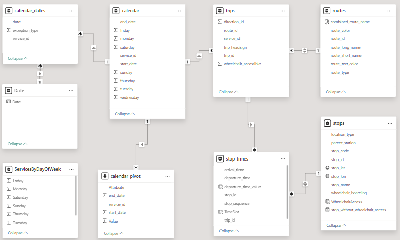
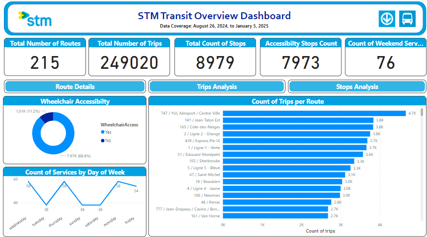
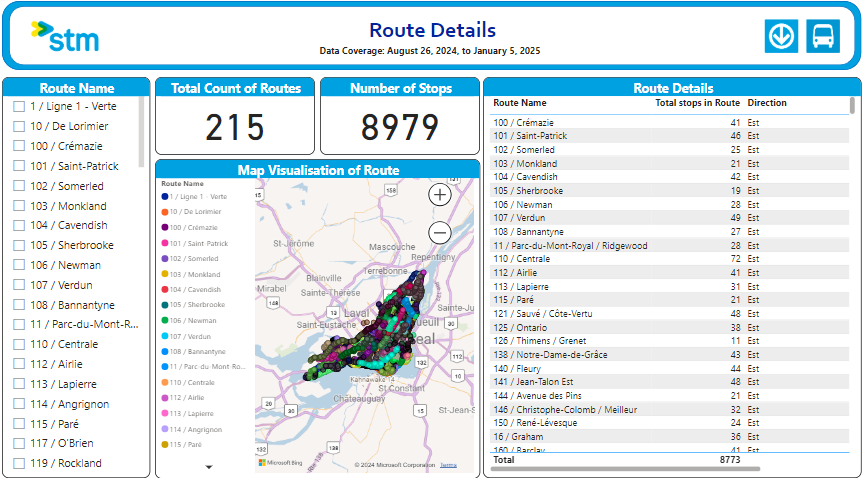
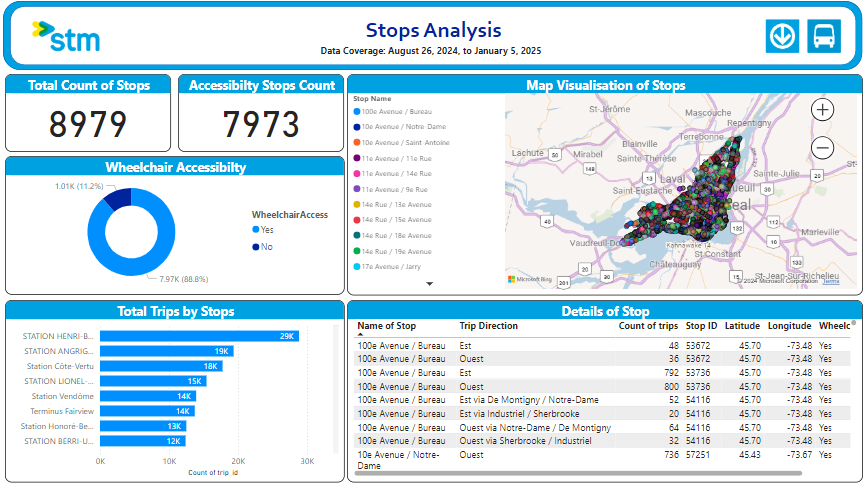

# STM Power BI Dashboard 🚍  
**Interactive Power BI dashboard analyzing STM transit data, focusing on accessibility and operational efficiency.**

## 🔍 Project Highlights
- **Dynamic Data Model**: Integrated 215 transit routes, 249,020 trips, and 8,979 stops.
  
- **Key Insights**:
  - Peak hours analysis with 166,579 trips during rush hours.
  - Accessibility focus with 88.8% of stops wheelchair-friendly.
- **Interactive Features**: Includes route maps, service breakdowns, and accessibility visuals.

## 📊 Tools & Technologies
- **Power BI Desktop**
- **Data Modeling**
- **Interactive Dashboards**

## 📸 Screenshots
  
 
 

## 📂 Files Included
- `STM_Report.pbix`: Power BI dashboard file.
- `README.md`: Project overview.
- `/images`: Dashboard screenshots.

## 💼 About Me
I’m a passionate Power BI developer seeking opportunities to create impactful dashboards. Let’s connect!  
- [LinkedIn](https://linkedin.com/in/hsbaruah1997)

---
